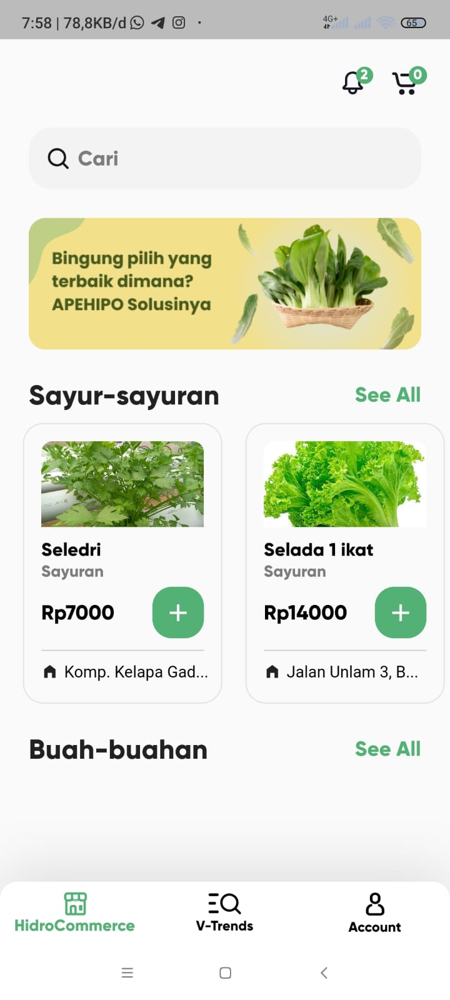
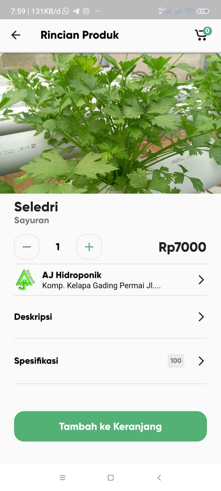
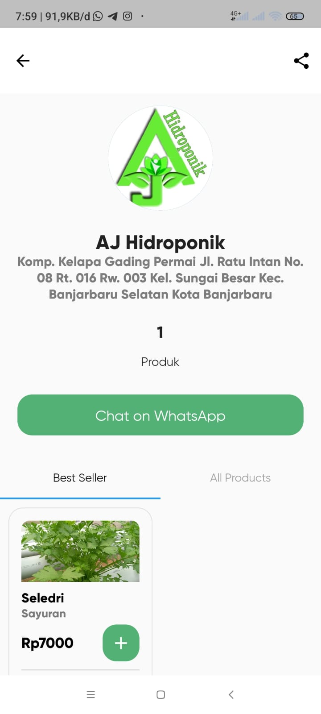
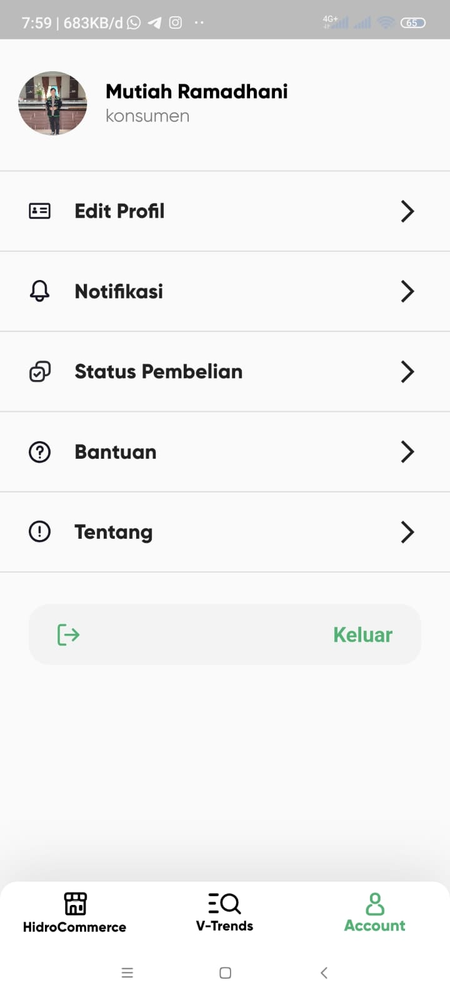
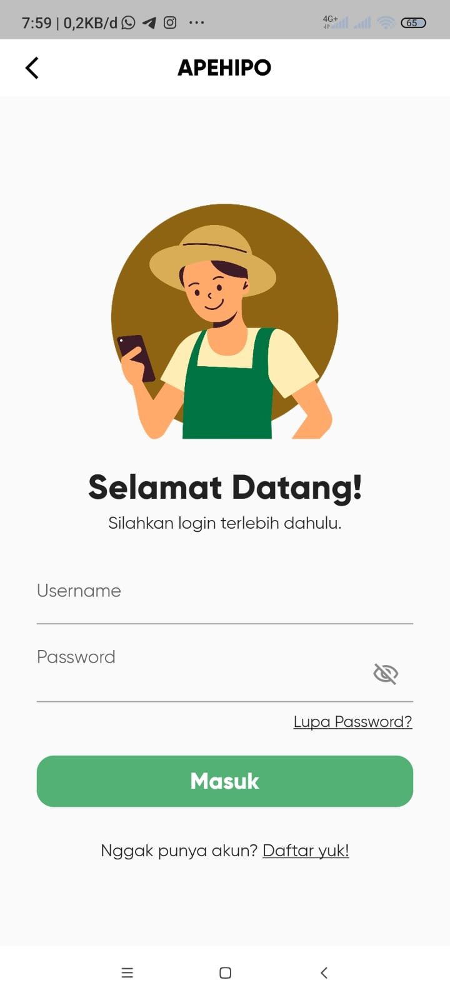
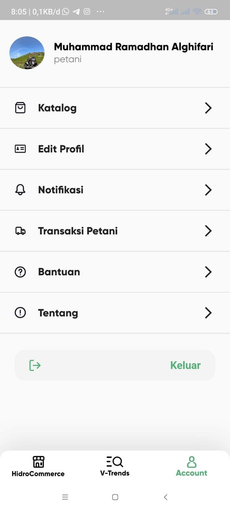

# Aplikasi Petani Hidroponik (APEHIPO)

APEHIPO adalah sebuah aplikasi yang dibangun menggunakan framework Flutter dan terintegrasi dengan backend API CodeIgniter. Aplikasi ini dirancang untuk membantu petani dalam pemasaran produk hidroponik mereka, serta memberikan fitur untuk mengakses tren pasar dan mengelola kebun hidroponik.

## Deskripsi Proyek

APEHIPO bertujuan untuk:
- Memudahkan petani dalam pemasaran produk hasil tanam hidroponik.
- Memberikan informasi tren pasar terkini terkait produk sayur dan buah hidroponik.
- Menyediakan fitur pengelolaan kebun hidroponik untuk memantau dan mengelola tanaman.

## Fitur Utama

1. **Hidrocommerce:**
   - Fitur untuk memfasilitasi petani dalam melakukan pemasaran produk mereka.
   - Memungkinkan petani untuk menjual produk hidroponik secara online.

2. **V-Trends:**
   - Menampilkan tren pasar terkini terkait produk sayur dan buah hidroponik.
   - Memberikan informasi tentang permintaan dan harga pasar yang sedang berlangsung.

3. **Kelola Kebun:**
   - Fitur yang memungkinkan petani untuk mengelola kebun hidroponik mereka.
   - Memantau perkembangan tanaman, memberikan perawatan, dan mencatat informasi penting.

## Instalasi dan Penggunaan

1. **Prasyarat:**
   - Pastikan sudah terpasang Flutter SDK dan sudah terintegrasi dengan platform yang akan digunakan (Android Studio/Xcode).

2. **Langkah-langkah:**
   - Clone repository ini ke dalam sistem lokal Anda.
   - Pastikan sudah terhubung ke backend API CodeIgniter yang terintegrasi.
   - Jalankan aplikasi di emulator atau perangkat fisik menggunakan perintah `flutter run`.

## Kontribusi

Kontribusi terhadap pengembangan aplikasi ini sangat dihargai. Jika Anda ingin berkontribusi, silakan buat *pull request* dan tim pengembang akan meninjaunya.

## Lisensi

Proyek ini dilisensikan di bawah Kementerian Hukum dan Hak Asasi Manusia. Untuk informasi lebih lanjut, silakan lihat file [LISENSI](./screenshots/sertifikat_EC002023100433.pdf).

## Kontak

Untuk informasi lebih lanjut atau pertanyaan, silakan hubungi kami di [email@example.com].

Terima kasih telah tertarik dengan Aplikasi Petani Hidroponik (APEHIPO)!

| Screenshot 1                        | Screenshot 2                        |
|--------------------------------|---------------------------------|
|    |     |
|    |     |
|    |     |

